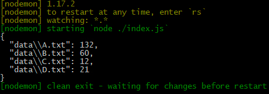

# Sum

A recursive file sum calculator that processes files containing numbers and nested file references.

## Requirements

### The Problem

Write a production-ready function that sums the numbers in a file. The function will receive as input the path to a file. Each line of the file will contain either a number or a path to another file. For each file, output the file path and the sum of the numbers contained both directly in the file or in any of the subfiles listed (or their subfiles, etc).

### Example

If file A.txt contains:
```
3
19
B.txt
50
```

And file B.txt contains:
```
C.txt
27
D.txt
```

And file C.txt contains:
```
10
2
```

And file D.txt contains:
```
1
2
3
4
5
6
```

**Expected Output:**
- C.txt sum: `12` (10 + 2)
- D.txt sum: `21` (1 + 2 + 3 + 4 + 5 + 6)
- B.txt sum: `60` (27 + 12 + 21)
- A.txt sum: `132` (3 + 19 + 50 + 60)

## Installation and Setup

### Prerequisites

#### Using Docker (Recommended)
- [Docker](https://www.docker.com/) installed on your system
- No Node.js installation required

#### Using Node.js Directly
- [Node.js](https://nodejs.org/) (version 10 or higher recommended)
- npm or [Yarn](https://yarnpkg.com/) package manager

### Technologies Used

- [Node.js](https://nodejs.org/) - JavaScript runtime
- [Nodemon](https://nodemon.io/) - Development server with auto-reload
- [Tape](https://github.com/ljharb/tape) - TAP-producing test harness

### Available Scripts

- `npm start` - Start the application in development mode with auto-reload (uses [nodemon](https://nodemon.io/))
- `npm run build` - Run the application once in production mode
- `npm test` - Run tests using [tape](https://github.com/ljharb/tape)

### How to Run

#### Using Docker (Recommended)

The easiest way to run this project is using Docker, which ensures it works in any environment:

1. Build the Docker image:
```bash
docker build -t sum .
```

2. Run the container:
```bash
docker run --rm sum
```

Or run in detached mode to stop manually:
```bash
docker run -d --name sum sum
```

3. To stop the container (if running in detached mode):
```bash
docker stop sum
docker rm sum
```

#### Using Node.js Directly

If you prefer to run without Docker:

1. Install dependencies:
```bash
npm install
```

2. Run the application:
```bash
npm run build
```

Or for development with auto-reload:
```bash
npm start
```

3. To stop the application, press `Ctrl+C`

### Running Tests

Run the comprehensive test suite:
```bash
npm test
```

The test suite includes:
- Single file with numbers only
- Nested file references (2-3 levels deep)
- Multiple nested files
- Empty lines and whitespace handling
- Zero and negative numbers
- Decimal numbers
- Windows line endings (CRLF)
- Non-existent file references
- Verification of actual data files

## Output



Example output format:
```json
{
  "data/A.txt": 132,
  "data/B.txt": 60,
  "data/C.txt": 12,
  "data/D.txt": 21
}
```

## Code Review & Analysis

This codebase has been evaluated by **Claude Sonnet 4.5** for functional programming practices, algorithm design, code quality, and security considerations.

### Evaluation Summary

**Overall Rating**: 8.0/10

**Key Strengths**:
- ✅ **Exceptional functional programming** - Pure functions, recursion, higher-order functions, currying
- ✅ **Elegant recursive algorithm** - Clean depth-first traversal with minimal code
- ✅ **Minimal code footprint** - Solves complex problem in ~30 lines
- ✅ **Comprehensive test coverage** - 21 tests covering core functionality and edge cases

**Notable Design Decisions**:
- Recursive [Depth-First Search](https://en.wikipedia.org/wiki/Depth-first_search) for file traversal
- Curried `parse` function for flexible composition
- Single-word verb naming matching native JavaScript patterns
- Use of `Object.assign` to flatten recursive results

**Areas for Enhancement**:
- Circular reference detection (prevent stack overflow)
- Explicit error handling (vs silent failures)
- Path traversal security protection
- JSDoc documentation

**Bug Fixed During Testing**:
- Directory handling issue when processing empty lines (added `isFile()` check)

### Full Review

For a comprehensive analysis including:
- Functional programming pattern deep dive
- Recursive algorithm complexity analysis
- Security vulnerability assessment
- Comparison with industry patterns (npm, webpack)
- Performance optimization recommendations

See the complete review: **[CODE_REVIEW.md](./CODE_REVIEW.md)
